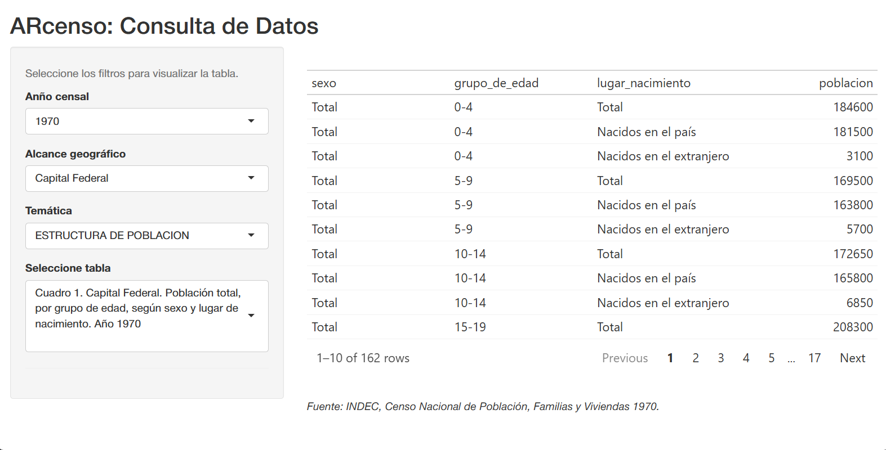

<!-- README.md is generated from README.Rmd. Please edit that file -->

# **ARcenso** 

<br clear="left"/>

<!-- badges: start -->

[](https://doi.org/10.5281/zenodo.15192435)

[](https://github.com/SoyAndrea/arcenso/actions/workflows/R-CMD-check.yaml)

[](https://app.codecov.io/gh/SoyAndrea/arcenso)
<!-- badges: end -->

# **Data from Argentina’s Population Census**

## Overview

This project was supported by the [rOpenSci Champions
Program](https://ropensci.org/blog/2024/02/15/champions-program-champions-2024/)
2023-2024, with [Andrea Gomez Vargas](https://github.com/SoyAndrea) as
the main developer and [Emanuel
Ciardullo](https://github.com/ECiardullo) as co-author.

**ARcenso** is a package under development designed to democratize
access to official data from Argentina’s National Population Censuses
produced by the National Institute of Statistics and Census (INDEC).

Currently, historical census results (1970, 1980, 1991, 2001, 2010, and
2022) are scattered across physical books, PDFs, Excel files, or closed
systems like REDATAM. This fragmentation makes it difficult to perform
historical analysis or serial comparisons.

**ARcenso** aims to make this data available, homogenized, and ready to
use in R.

> **Note:** The available data is being added in stages. Currently, the
> package is in **Stage 1**.

## Data Availability Roadmap

| Stage | Census years | Geographic level | Notes |
|----|----|----|----|
| **1** | 1970 | National and 24 jurisdictions | First available census data |
|  | 1980 | National level | Jurisdiction-level data not available |
| 2 | 1991 and 2001 | National level | Coming soon |
| 3 | 2010 | National level | Coming soon |
| 4 | 2022 | National level | Coming soon |
| 5 | 1980 and 1991 | 24 jurisdictions | Coming soon |
| 6 | 2001 and 2010 | 24 jurisdictions | Coming soon |
| 7 | 2022 | 24 jurisdictions | Coming soon |

## Installation

You can install the development version of arcenso from
[GitHub](https://github.com/) with:

``` r
# install.packages("remotes")
# if you do not have remotes installed

remotes::install_github("SoyAndrea/arcenso")
```

## Main functions

**arcenso** provides three core tools:

- `arcenso_gui()`: Launches a Shiny app to query and visualize available
  tables interactively.

- `check_repository()`: Reports the tables currently available in the
  package based on search criteria.

- `get_census()`: Retrieves the actual datasets as a list of data
  frames.

## Usage

First, load the library:

``` r
library(arcenso)
```

### Interactive Exploration (Shiny App)

The easiest way to discover available data is through the built-in
interface. You can browse tables, filter by geographic level, and copy
the exact Table ID you need.

To launch the application locally, run:

``` r
# Launch the interactive Shiny application
arcenso_gui()
```

Look at the interactive interface in action:

<figure>

<figcaption aria-hidden="true">Interactive Exploration with
ARcenso</figcaption>
</figure>

### Exploring the Repository

Before downloading data, you can check which tables are available for a
specific year, topic, and geographic level using `check_repository()`:

``` r
# Check available tables for 1970 related to "educacion"
check_repository(
  year = 1970,
  topic = "educacion"
)
#> # A tibble: 75 × 3
#>    id_cuadro            cod_geo titulo                                          
#>    <chr>                <chr>   <chr>                                           
#>  1 1970_00_educacion_01 00      Cuadro 7. Total del país. Población de 10 y más…
#>  2 1970_00_educacion_02 00      Cuadro 8. Total del país. Población de 5 y más …
#>  3 1970_00_educacion_03 00      Cuadro 9. Total del país. Población de 5 y más …
#>  4 1970_02_educacion_01 02      Cuadro 3. Capital Federal. Población de 10 y má…
#>  5 1970_02_educacion_02 02      Cuadro 4. Capital Federal. Población de 5 y más…
#>  6 1970_02_educacion_03 02      Cuadro 5. Capital Federal. Población de 5 y más…
#>  7 1970_06_educacion_01 06      Cuadro 3. Provincia de Buenos Aires. Población …
#>  8 1970_06_educacion_02 06      Cuadro 4. Provincia de Buenos Aires. Población …
#>  9 1970_06_educacion_03 06      Cuadro 5. Provincia de Buenos Aires. Población …
#> 10 1970_10_educacion_01 10      Cuadro 3. Provincia de Catamarca. Población de …
#> # ℹ 65 more rows
```

### Accessing Census Data

Once you have identified the table you need (either by ID or topic), use
`get_census()` to retrieve the data.

#### Get specific table by ID (Recommended)

This is the most robust method for reproducible research.

``` r
# Download specific table (e.g., Structure of Population, National level)
census_data <- get_census(
  year = 1970,
  id = "1970_00_estructura_01"
)

census_data
#> $`1970_00_estructura_01`
#> # A tibble: 54 × 3
#>    grupo_de_edad sexo    poblacion
#>    <chr>         <chr>   <chr>    
#>  1 0-4           Total   2355300  
#>  2 0-4           Varones 1196950  
#>  3 0-4           Mujeres 1158350  
#>  4 5-9           Total   2297000  
#>  5 5-9           Varones 1163050  
#>  6 5-9           Mujeres 1133950  
#>  7 10-14         Total   2201150  
#>  8 10-14         Varones 1114300  
#>  9 10-14         Mujeres 1086850  
#> 10 15-19         Total   2098700  
#> # ℹ 44 more rows
```

#### Search by topic and geography

You can also filter directly while requesting data.

``` r
# Download 1970 housing data for Tierra del Fuego (geo_code "94")
table_hab_94 <- get_census(
  year = 1970,
  topic = "habitacional",
  geo_code = "94"
)

table_hab_94
#> $`1970_94_habitacional_01`
#> # A tibble: 4 × 4
#>   regimen_de_tenencia                 hogares personas cuartos
#>   <chr>                               <chr>   <chr>    <chr>  
#> 1 Inquilino o arrendatario            784     2772     2132   
#> 2 Ocupante en relación de dependencia 713     2388     2321   
#> 3 Ocupante gratuito                   122     353      377    
#> 4 En otro carácter                    39      154      107
```

## Reference Dictionaries

Don’t know the geographic code for a province? Want to see all available
topics? The package includes built-in datasets for quick reference.

### Geographic Codes (`geo_code`)

Use `geo_metadata` to look up the INDEC codes required for filtering.

``` r
# View the full table of geographic codes
head(arcenso::geo_metadata)
#> # A tibble: 6 × 4
#>   cod_geo nombre_geo                      nombre_corto iso_3166_2
#>   <chr>   <fct>                           <chr>        <chr>     
#> 1 00      Total del País                  Total        AR        
#> 2 02      Ciudad Autónoma de Buenos Aires CABA         AR-C      
#> 3 06      Buenos Aires                    Buenos Aires AR-B      
#> 4 10      Catamarca                       Catamarca    AR-K      
#> 5 14      Córdoba                         Córdoba      AR-X      
#> 6 18      Corrientes                      Corrientes   AR-W
```

### Available Topics (`census_metadata`)

You can list all unique topics available in the census metadata using
standard R commands:

``` r
# List all unique topics

unique(arcenso::census_metadata$tema)
#> [1] estructura   fecundidad   educacion    conyugal     actividad   
#> [6] migracion    composicion  habitacional vivienda    
#> 9 Levels: estructura fecundidad educacion conyugal actividad ... vivienda
```

## Acknowledgments

This package was developed as part of the **[rOpenSci Champions
Program](https://ropensci.org/champions/) (2023-2024)**.

We would like to express our special gratitude to:

- **[Yanina Bellini Saibene](https://github.com/yabellini)** (Program
  Leader) for her constant support, accompaniment, and guidance in
  structuring the project workflow.

- **[Luis D. Verde Arregoitia](https://github.com/luisDVA)** for his
  invaluable mentorship, patience, and guidance throughout the
  development process.

- **[Tamara Giselle Derner](https://www.linkedin.com/in/tamaraderner/)**
  for designing the hex sticker and finding the perfect symbol to give
  the package a true national identity.

- The **rOpenSci community** for fostering diverse participation, and
  the wider **R community** for their interest and company along the
  way.

## Citation

If you use **ARcenso** in your research or projects, please cite it as
follows:

Gomez Vargas, A., & Ciardullo, E. (2025). arcenso: Data from Argentina’s
Population Census. R package version 0.1.0. Available at:
<https://soyandrea.github.io/arcenso/>

You can also get the BibTeX entry by running:

``` r
citation("arcenso")
```

``` bibtex
@Manual{,
  title = {arcenso: Data from Argentina's Population Census},
  author = {Andrea Gomez Vargas <andrea.gomezv11@gmail.com> [aut, cre] (ORCID: <https://orcid.org/0009-0007-8745-3967>)},
  year = {2026},
  note = {R package version 0.2.1},
  url = {https://soyandrea.github.io/arcenso/, https://doi.org/10.5281/zenodo.18378026},
}
```

## Contributing

We welcome contributions in both **English** and **Spanish**. Please see
our [Contributing Guidelines](.github/CONTRIBUTING.md) for more details.

## Code of Conduct

Please note that the `arcenso` project is released with a [Contributor
Code of Conduct](.github/CODE_OF_CONDUCT.md). By contributing to this
project, you agree to abide by its terms.
