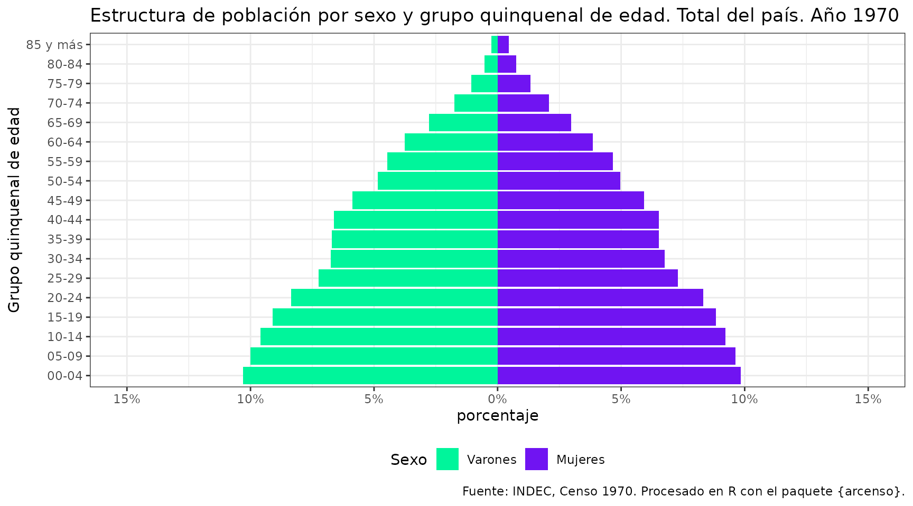

# Visualización demográfica: Pirámide de Población

En este artículo veremos un flujo de trabajo completo utilizando
`arcenso`: desde la búsqueda de datos hasta la visualización final. El
objetivo es construir una pirámide de población utilizando los datos del
Censo Nacional de población de 1970.

> La pirámide de población constituye una representación gráfica
> fundamental para el análisis demográfico. Su función principal es
> visualizar la composición por sexo y edad de una población,
> permitiendo identificar patrones estructurales como el envejecimiento,
> la transición demográfica o el impacto de procesos migratorios.

## Paquetes de trabajo

Además de `arcenso`, utilizaremos paquetes del ecosistema
`tidyverse`(dplyr para manipulación de datos y ggplot2 para el gráfico).

``` r
library(arcenso)
library(dplyr)
library(ggplot2)
```

## Obtención de los datos

Antes de descargar, es útil saber qué códigos geográficos utilizar. El
paquete incluye datasets de metadatos (`geo_metadata` y
`census_metadata`) que facilitan esta tarea.

Por ejemplo, si quisiéramos consultar los códigos de las jurisdicciones
disponibles:

``` r
# Consultamos los metadatos geográficos para ver los códigos de las provincias
head(geo_metadata)
#> # A tibble: 6 × 4
#>   cod_geo nombre_geo                      nombre_corto iso_3166_2
#>   <chr>   <fct>                           <chr>        <chr>     
#> 1 00      Total del País                  Total        AR        
#> 2 02      Ciudad Autónoma de Buenos Aires CABA         AR-C      
#> 3 06      Buenos Aires                    Buenos Aires AR-B      
#> 4 10      Catamarca                       Catamarca    AR-K      
#> 5 14      Córdoba                         Córdoba      AR-X      
#> 6 18      Corrientes                      Corrientes   AR-W
```

Para este ejemplo, utilizaremos el código “00” (Total del país) y la
palabra clave “estructura” para filtrar el tema objetivo.

> Es importante notar que la función
> [`get_census()`](https://soyandrea.github.io/arcenso/reference/get_census.md)
> está diseñada para devolver siempre un objeto de tipo lista. Esta
> decisión de diseño garantiza la consistencia, ya que una misma
> búsqueda podría resultar en múltiples tablas de datos.

Por lo tanto, el flujo de trabajo estándar consiste en descargar la
lista y luego extraer el data frame específico que deseamos analizar.

``` r
# 1. Descargamos los datos (Obtenemos una lista de resultados)
lista_censo <- get_census(
  year = 1970,
  topic = "estructura",
  geo_code = "00"
)

# Verificamos el contenido de la lista
class(lista_censo)
#> [1] "list"
length(lista_censo)
#> [1] 1

# 2. Extracción de la tabla
# Como sabemos que nuestra búsqueda es específica, tomamos el primer elemento
poblacion_1970 <- lista_censo[[1]]

# Ahora sí, tenemos un data frame listo para trabajar
head(poblacion_1970)
#> # A tibble: 6 × 3
#>   grupo_de_edad sexo    poblacion
#>   <chr>         <chr>   <chr>    
#> 1 0-4           Total   2355300  
#> 2 0-4           Varones 1196950  
#> 3 0-4           Mujeres 1158350  
#> 4 5-9           Total   2297000  
#> 5 5-9           Varones 1163050  
#> 6 5-9           Mujeres 1133950
```

## Procesamiento y transformación de datos

Para construir la pirámide de población, es necesario adaptar los datos
censales originales mediante tres operaciones clave con `dplyr`:

- Filtrado: Se excluyen los registros correspondientes al “Total”
  general para evitar duplicaciones en el gráfico.

- Recodificación: Se estandarizan las etiquetas de los grupos de edad
  (por ejemplo, convirtiendo “0-4” a “00-04”) para garantizar su
  correcto ordenamiento cronológico en el eje vertical.

- Transformación numérica: Se invierte el signo de la población
  masculina (valores negativos) para generar la simetría característica
  de las pirámides demográficas.

``` r
datos_piramide <- poblacion_1970 |> 
  # 1. Filtramos para conservar únicamente los datos desagregados por sexo
  filter(sexo != "Total") |> 
  mutate(
    # 2. Recodificación para asegurar el orden secuencial
    grupo_de_edad = case_when(
      grupo_de_edad == "0-4" ~ "00-04",
      grupo_de_edad == "5-9" ~ "05-09",
      TRUE ~ grupo_de_edad
    ),
    # Conversión a variable numérica
    poblacion = as.numeric(poblacion)
  ) |> 
  # 3. Cálculo de la estructura relativa
  group_by(sexo)  |> 
  mutate(
    poblacion_rel = if_else(
      sexo == "Varones",
      -poblacion / sum(poblacion), # Valores negativos para el lado izquierdo
      poblacion / sum(poblacion) # Valores positivos para el lado derecho
    )
  ) |> 
  ungroup()


# Podemos observar el resultado
head(datos_piramide)
#> # A tibble: 6 × 4
#>   grupo_de_edad sexo    poblacion poblacion_rel
#>   <chr>         <chr>       <dbl>         <dbl>
#> 1 00-04         Varones   1196950       -0.103 
#> 2 00-04         Mujeres   1158350        0.0984
#> 3 05-09         Varones   1163050       -0.100 
#> 4 05-09         Mujeres   1133950        0.0963
#> 5 10-14         Varones   1114300       -0.0959
#> 6 10-14         Mujeres   1086850        0.0923
```

## Visualización

Finalmente, procedemos a la representación gráfica utilizando `ggplot2`.

``` r
datos_piramide  |> 
  mutate(sexo = factor(sexo, levels = c("Varones", "Mujeres")))  |> 
  ggplot(aes(x = poblacion_rel, y = grupo_de_edad, fill = sexo)) +
  geom_col() +
  scale_fill_manual(values = c("#00f59b", "#7014f2")) +
  # Ajuste del eje X: etiquetas en % absoluto y límites simétricos
  scale_x_continuous(
    labels = function(x) paste0(abs(round(x * 100, 1)), "%"),
    limits = c(-0.15, 0.15),
    breaks = seq(-0.15, 0.15, by = 0.05)
  ) +
  labs(
    title = 
      "Estructura de población por sexo y grupo quinquenal de edad. Total del país. Año 1970",
    x = "porcentaje",
    y = "Grupo quinquenal de edad",
    caption = "Fuente: INDEC, Censo 1970. Procesado con paquete {arcenso}.",
    fill = "Sexo"
  ) +
  theme_bw() +
  theme(legend.position = "bottom")
```



En este artículo se detalló el flujo de trabajo para transformar datos
censales brutos en una visualización analítica. A partir de la
estructura de datos obtenida, es posible extender este procedimiento
para calcular otros indicadores demográficos
