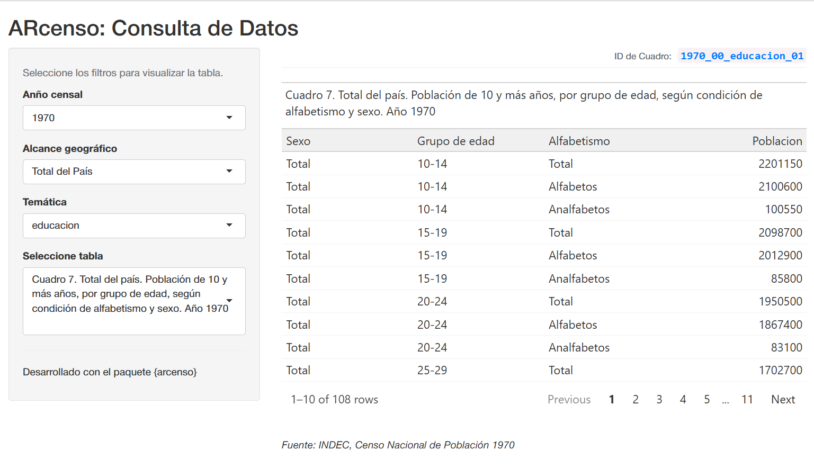

```{r, include = FALSE}
knitr::opts_chunk$set(
  collapse = TRUE,
  comment = "#>"
)

```

**ARcenso** es un paquete diseñado para facilitar el acceso a los datos de los Censos Nacionales de Población, Hogares y Viviendas de Argentina. Los datos se entregan en formatos estándar de R, compatibles tanto con **R base** como con el ecosistema **Tidyverse**.

> **Nota sobre disponibilidad:** El paquete se encuentra en desarrollo activo. Actualmente, el repositorio contiene una selección de tablas históricas de 1970 y 1980. La cobertura de años y niveles geográficos se irá completando progresivamente.

## Instalación y Carga

Puedes instalar la versión de desarrollo desde GitHub:

```{r instalacion, eval=FALSE}
# install.packages("remotes")
remotes::install_github("SoyAndrea/arcenso")
```


Cargamos el paquete:

```{r}
library(arcenso)
```


## Consultar disponibilidad de datos

Previo a la descarga, es necesario identificar las tablas disponibles en el repositorio. El paquete ofrece dos métodos para realizar esta consulta:


### Opción A: Explorador Interactivo (Recomendado)

Esta función ejecuta una aplicación Shiny integrada en el paquete. A través de su interfaz gráfica, es posible explorar el catálogo de datos, aplicar filtros y visualizar la información de manera dinámica.

Asimismo, permite copiar el identificador (ID) del cuadro seleccionado para utilizarlo posteriormente como argumento en las funciones de descarga.


```{r shinyapp, eval=FALSE}
arcenso_gui()
```

Ejemplo:

```{r gui-preview, echo=FALSE, out.width="90%", fig.align="center", fig.alt="Captura de pantalla de la aplicación Shiny mostrando los filtros y el ID de cuadro"}

```


Como se observa en la interfaz, tras seleccionar los filtros (año, alcance y temática), el sistema muestra una previsualización de los datos.

> **Dato clave**: En el margen superior derecho de la tabla se encuentra el ID de Cuadro _(por ejemplo: 1970_00_educacion_01)._ Puede copiar este identificador para solicitar la tabla específica mediante código en el siguiente paso.

### Opción B: Consulta vía Consola


Alternativamente, es posible consultar el catálogo directamente desde la consola de R mediante la función `check_repository()`.

Esta función devuelve un listado con los metadatos de las tablas que coinciden con los criterios de búsqueda. A continuación, se ejemplifica la consulta para el tópico migración en el año 1970:

```{r check}
# La función nos listará los IDs de cuadro, código geográfico y títulos disponibles
check_repository(
  year = 1970, 
  topic = "migracion"
)
```


## Descargar datos

Una vez identificada la información de interés, se utiliza la función `get_census()`.

Es importante destacar que esta función retorna invariablemente un objeto de tipo lista, el cual contiene uno o más data frames correspondientes a las tablas solicitadas.

### Opción A: Usando R Base

No necesitas dependencias externas para usar arcenso.

```{r}
# Descargamos
datos_censo <- get_census(
  year = 1970, 
  topic = "migracion", 
  geo_code = "00"
)

# Extraemos la segunda tabla de la lista por su índice
tabla_migracion <- datos_censo[[2]]

# Vemos las primeras filas
head(tabla_migracion)
```


### Opción B: Usando Tidyverse

Si usas paquetes como dplyr, puedes integrar la descarga directamente en tu flujo de trabajo.

```{r warning=FALSE}
library(dplyr)

# Descargamos
datos_censo <- get_census(
  year = 1970, 
  topic = "migracion", 
  geo_code = "00"
)

# Accedemos a la primera tabla de la lista y miramos su estructura
datos_censo[[2]] %>% 
  glimpse()
```

### Opción C: Descarga directa por ID (Precisión máxima)

Si obtuviste un identificador específico (ej. `1970_00_educacion_01`) desde la aplicación Shiny o mediante `check_repository()`, puedes usarlo para descargar **únicamente** esa tabla.

Esto es ideal para scripts reproducibles donde quieres asegurarte de estar trabajando siempre con el mismo cuadro.

```{r get-id}
# Descarga usando el ID específico del cuadro
tabla_educacion <- get_census(id = "1970_00_educacion_01")

# Inspeccionamos el resultado
tabla_educacion
```


## Siguientes pasos y Comunidad

Ahora que dispones de los datos, el siguiente paso es integrarlos en tus análisis.

* **Tutoriales:** Para ver un flujo de trabajo completo que incluye limpieza de datos y visualización con `ggplot2`, te recomendamos leer nuestro artículo: [Ejemplo: Pirámide de Población](piramide_poblacion.html).
* **Citación:** ARcenso es un desarrollo de código abierto. Si utilizas estos datos en investigaciones o publicaciones, por favor cita el paquete ejecutando `citation("arcenso")` en tu consola.
* **Feedback:** Si encuentras errores o tienes sugerencias de mejora, te invitamos a abrir un *issue* en nuestro [repositorio de GitHub](https://github.com/SoyAndrea/arcenso).
Revisi
